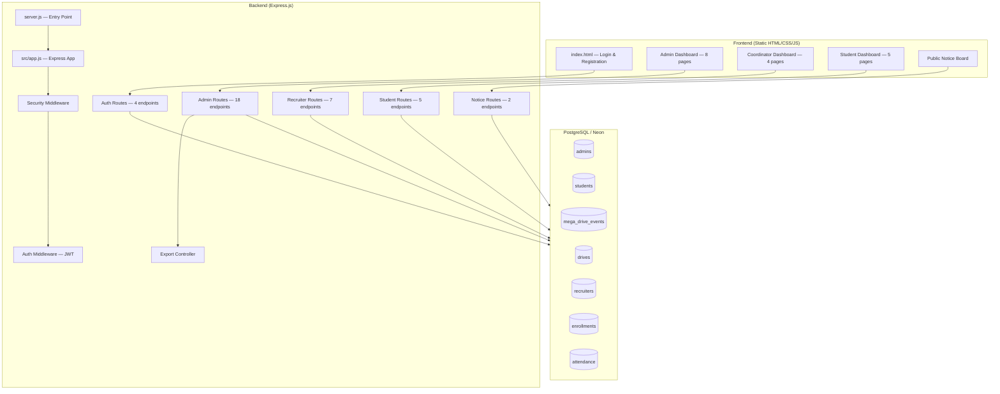
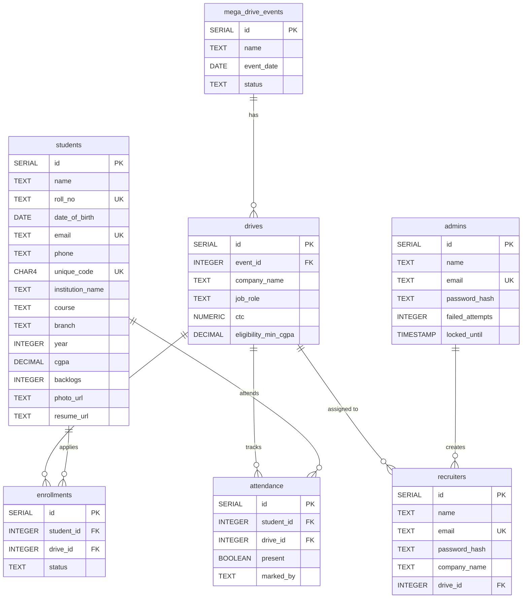

# 📊 Vidya Sethu — Placement Cell Management System
## Complete Project Analysis Report

---

## 1. Project Overview

| Property | Value |
|---|---|
| **Project Name** | Vidya Sethu — Training & Placement Cell Management System |
| **Institution** | Sandip University |
| **Architecture** | Monolithic (Express.js backend + static HTML/CSS/JS frontend) |
| **Database** | PostgreSQL on Neon (serverless) |
| **Hosting Target** | Render / Railway (serverless cloud) |
| **Target Users** | ~1,500 students, admins, company coordinators |
| **Node.js** | ≥ 18.0.0 |

---

## 2. Architecture Diagram



---

## 3. Technology Stack

### Backend Dependencies

| Package | Version | Purpose |
|---|---|---|
| `express` | ^4.18.2 | Web framework |
| `@neondatabase/serverless` | ^0.9.3 | Neon PostgreSQL driver (WebSocket-based) |
| `bcryptjs` | ^2.4.3 | Password hashing |
| `jsonwebtoken` | ^9.0.2 | JWT authentication |
| `helmet` | ^7.1.0 | Security headers |
| `cors` | ^2.8.5 | Cross-Origin Resource Sharing |
| `express-rate-limit` | ^7.3.1 | API rate limiting |
| `express-slow-down` | ^2.0.3 | Progressive request throttling |
| `compression` | ^1.7.4 | Response compression |
| `qrcode` | ^1.5.3 | QR code generation for attendance |
| `ws` | ^8.20.0 | WebSocket support for Neon driver |
| `dotenv` | ^16.4.5 | Environment variable management |

### Frontend Stack
- **Pure HTML/CSS/JS** — No framework
- **Font Awesome** via CDN (icons)
- **Google Fonts** (typography)
- Global stylesheet: [css/style.css](file:///c:/Users/radha/OneDrive/Desktop/Placement%20cell/Frontend/css/style.css) (34 KB)
- Shared API helper: [js/api.js](file:///c:/Users/radha/OneDrive/Desktop/Placement%20cell/Frontend/js/api.js) (9 KB)

---

## 4. Database Schema

### 7 Tables — Entity Relationship



---

## 5. API Endpoints Summary

### Authentication (Public)
| Method | Endpoint | Description |
|---|---|---|
| GET | `/api/auth/registration-status` | Check if registration is open |
| POST | `/api/auth/register-student` | Student self-registration |
| POST | `/api/auth/student-login` | Login via phone + DOB |
| POST | `/api/auth/admin-login` | Admin login with brute-force protection |
| POST | `/api/auth/recruiter-login` | Coordinator login |

### Admin (Protected — 18 endpoints)
| Method | Endpoint | Description |
|---|---|---|
| GET | `/api/admin/dashboard` | Dashboard stats |
| GET/DELETE | `/api/admin/students` | Manage students |
| CRUD | `/api/admin/events` | Manage mega drive events |
| CRUD | `/api/admin/drives` | Manage company drives |
| CRUD | `/api/admin/recruiters` | Manage coordinators (max 2 per drive) |
| GET/PUT | `/api/admin/enrollments/:driveId` | View/update enrollment statuses |
| GET | `/api/admin/attendance-summary` | Cross-event attendance report |
| GET | `/api/admin/pipeline/:driveId` | Drive recruitment funnel |
| GET | `/api/admin/export/full` | Full data export (Excel-ready JSON) |

### Coordinator (Protected — 7 endpoints)
| Method | Endpoint | Description |
|---|---|---|
| GET | `/api/recruiter/dashboard` | Coordinator's drive stats |
| GET | `/api/recruiter/students` | Enrolled students list |
| PUT | `/api/recruiter/drive-details` | Update job role/CTC |
| POST | `/api/recruiter/attendance` | Mark individual attendance |
| POST | `/api/recruiter/bulk-attendance` | Bulk attendance marking |
| POST | `/api/recruiter/attendance-by-code` | 4-digit code check-in |
| PUT | `/api/recruiter/status/:id` | Update enrollment status |

### Student (Protected — 5 endpoints)
| Method | Endpoint | Description |
|---|---|---|
| GET/PUT | `/api/student/profile` | View/edit profile |
| GET | `/api/student/my-code` | Get 4-digit unique code |
| GET | `/api/student/companies` | View companies in open events |
| GET | `/api/student/journey` | Placement journey tracker |

---

## 6. Frontend Pages

### Admin Portal (8 pages)
| Page | Size | Purpose |
|---|---|---|
| [dashboard.html](file:///c:/Users/radha/OneDrive/Desktop/Placement%20cell/Frontend/admin/dashboard.html) | 39 KB | Main admin dashboard with stats |
| [students.html](file:///c:/Users/radha/OneDrive/Desktop/Placement%20cell/Frontend/admin/students.html) | 17 KB | Student management with filters |
| [drives.html](file:///c:/Users/radha/OneDrive/Desktop/Placement%20cell/Frontend/admin/drives.html) | 24 KB | Company drive management |
| [enrollments.html](file:///c:/Users/radha/OneDrive/Desktop/Placement%20cell/Frontend/admin/enrollments.html) | 20 KB | Enrollment tracking |
| [attendance.html](file:///c:/Users/radha/OneDrive/Desktop/Placement%20cell/Frontend/admin/attendance.html) | 22 KB | Attendance management |
| [pipeline.html](file:///c:/Users/radha/OneDrive/Desktop/Placement%20cell/Frontend/admin/pipeline.html) | 18 KB | Recruitment pipeline view |
| [recruiters.html](file:///c:/Users/radha/OneDrive/Desktop/Placement%20cell/Frontend/admin/recruiters.html) | 17 KB | Coordinator management |
| [export.html](file:///c:/Users/radha/OneDrive/Desktop/Placement%20cell/Frontend/admin/export.html) | 33 KB | Data export to Excel |

### Coordinator Portal (4 pages)
| Page | Size | Purpose |
|---|---|---|
| [dashboard.html](file:///c:/Users/radha/OneDrive/Desktop/Placement%20cell/Frontend/admin/dashboard.html) | 31 KB | Coordinator dashboard |
| [students.html](file:///c:/Users/radha/OneDrive/Desktop/Placement%20cell/Frontend/admin/students.html) | 60 KB | Student list with attendance/results |
| [attendance.html](file:///c:/Users/radha/OneDrive/Desktop/Placement%20cell/Frontend/admin/attendance.html) | Placeholder | Attendance page |
| [results.html](file:///c:/Users/radha/OneDrive/Desktop/Placement%20cell/Frontend/cordinator/results.html) | Placeholder | Results page |

### Student Portal (5 pages)
| Page | Size | Purpose |
|---|---|---|
| [dashboard.html](file:///c:/Users/radha/OneDrive/Desktop/Placement%20cell/Frontend/admin/dashboard.html) | 8 KB | Student dashboard |
| [profile.html](file:///c:/Users/radha/OneDrive/Desktop/Placement%20cell/Frontend/student/profile.html) | 15 KB | Profile editor |
| [drives.html](file:///c:/Users/radha/OneDrive/Desktop/Placement%20cell/Frontend/admin/drives.html) | 4 KB | View available companies |
| [journey.html](file:///c:/Users/radha/OneDrive/Desktop/Placement%20cell/Frontend/student/journey.html) | 5 KB | Placement journey tracker |
| [attendance.html](file:///c:/Users/radha/OneDrive/Desktop/Placement%20cell/Frontend/admin/attendance.html) | Placeholder | Self-attendance |

### Public Pages
| Page | Size | Purpose |
|---|---|---|
| [index.html](file:///c:/Users/radha/OneDrive/Desktop/Placement%20cell/Frontend/index.html) | 25 KB | Login/landing page |
| [register.html](file:///c:/Users/radha/OneDrive/Desktop/Placement%20cell/Frontend/register.html) | 37 KB | Student registration form |
| [notice.html](file:///c:/Users/radha/OneDrive/Desktop/Placement%20cell/Frontend/notice.html) | 6 KB | Public notice board with QR |

---

## 7. Security Analysis

### ✅ Strengths
| Feature | Implementation |
|---|---|
| **Helmet** | Full CSP with script/style/font/img directives |
| **Rate Limiting** | Global (500/min), Auth (30/15min), Register (15/hour) |
| **Slow-Down** | Progressive delay after 200 requests |
| **Brute-Force Protection** | Admin lockout after 5 failures for 15 minutes |
| **Input Sanitization** | Null byte removal + trimming on body/query/params |
| **Prototype Pollution Guard** | Deletes `__proto__`, `constructor`, `prototype` |
| **Timing-Safe Auth** | Dummy bcrypt compare even when user not found |
| **JWT HS256** | Algorithm-locked to prevent algorithm confusion attacks |
| **Payload Limits** | 50 KB for JSON and URL-encoded bodies |
| **Graceful Shutdown** | SIGTERM handling for cloud deploys |

### ⚠️ Issues Found

> [!CAUTION]
> **Exposed Database Credentials** — The [.env](file:///c:/Users/radha/OneDrive/Desktop/Placement%20cell/backend/.env) file contains a live Neon database connection string. The [.env](file:///c:/Users/radha/OneDrive/Desktop/Placement%20cell/backend/.env) comment itself says the old URL was "exposed in git." Ensure [.env](file:///c:/Users/radha/OneDrive/Desktop/Placement%20cell/backend/.env) is never committed and **rotate the database password immediately**.

> [!WARNING]
> **Dual Routing Structure** — There are two sets of routes:
> - `backend/routes/` (legacy, referenced by `config/db.js` using plain `pg`)
> - `backend/src/routes/` (active, used by `app.js`, using `@neondatabase/serverless`)
>
> Only `src/routes/` are actually loaded by the app. The legacy `routes/` folder contains stale code referencing dropped columns (`drive_date`, `status` on drives, `attendance_code` on drives). These should be deleted to avoid confusion.

> [!WARNING]
> **Student Login — No Password** — Student login uses phone + DOB (no password). While convenient for mass events, this is weak authentication. Anyone knowing a student's phone and DOB can access their account.

> [!IMPORTANT]
> **No HTTPS Enforcement** — The server doesn't enforce HTTPS redirects or HSTS (handled by the hosting platform, but worth noting).

> [!IMPORTANT]
> **`.gitignore` excludes `.env.example`** — This means new developers cloning the repo won't get the template file. Line 4 (`.env.*`) should exclude `.env.local`, `.env.production`, etc. but not `.env.example`.

---

## 8. Code Quality Assessment

| Aspect | Rating | Notes |
|---|---|---|
| **Structure** | ⭐⭐⭐⭐ | Clean MVC-like: controllers → routes → middleware |
| **Error Handling** | ⭐⭐⭐⭐ | Consistent try/catch with `{ success, message }` pattern |
| **Validation** | ⭐⭐⭐ | Good in `authController`, inconsistent elsewhere |
| **SQL Injection** | ⭐⭐⭐⭐⭐ | All queries use parameterized `$1, $2...` — no string concatenation |
| **Migration System** | ⭐⭐⭐⭐ | Idempotent IF NOT EXISTS migrations, auto-run on startup |
| **Dead Code** | ⭐⭐ | Legacy `routes/` and `config/db.js` are unused dead code |
| **Testing** | ⭐ | No tests exist (unit, integration, or E2E) |
| **Documentation** | ⭐⭐ | Good inline comments, but no API docs or README |
| **Frontend Code** | ⭐⭐⭐ | Large inline HTML/JS files — no component framework |

---

## 9. Key Features Implemented

1. **Multi-Role System** — Admin, Coordinator, Student (3 distinct dashboards)
2. **Mega Drive Events** — Events containing multiple company drives
3. **Student Registration** — Event-gated self-registration with profile building
4. **4-Digit Unique Code** — Quick check-in system for coordinators
5. **Enrollment Pipeline** — Applied → Shortlisted → Offered/Rejected tracking
6. **Attendance Tracking** — Per-drive attendance with coordinator/student marking
7. **Branch-Wise Analytics** — Pipeline breakdown by student branch
8. **Data Export** — Full JSON export for Excel reporting
9. **QR Code Generation** — Public notice board with QR-based attendance links
10. **Auto-Migration** — Schema migrations run on every server start

---

## 10. File Structure Summary

```
Placement cell/
├── backend/
│   ├── server.js                  # Entry point — migrations → listen
│   ├── src/
│   │   ├── app.js                 # Express app setup + security + routes
│   │   ├── config/db.js           # Neon serverless DB pool (ACTIVE)
│   │   ├── migrate.js             # 9 idempotent migrations
│   │   ├── middleware/
│   │   │   ├── auth.js            # JWT protect + role guards
│   │   │   └── security.js        # Helmet, CORS, rate-limit, sanitize
│   │   ├── controllers/
│   │   │   ├── authController.js      # Login/register (312 lines)
│   │   │   ├── adminController.js     # Admin CRUD (431 lines)
│   │   │   ├── recruiterController.js # Coordinator ops (249 lines)
│   │   │   ├── studentController.js   # Student profile/journey (117 lines)
│   │   │   └── exportController.js    # Excel data export (83 lines)
│   │   └── routes/                # 5 route files mapping endpoints
│   ├── config/db.js               # ⚠️ LEGACY — plain pg (unused)
│   ├── routes/                    # ⚠️ LEGACY — old routes (unused)
│   ├── middleware/auth.js         # ⚠️ LEGACY — old auth (unused)
│   ├── scripts/
│   │   ├── initDb.js              # Schema creation script
│   │   └── reset-admin.js         # Admin password reset utility
│   ├── schema.sql                 # Full DB schema reference
│   └── *.sql                      # Individual migration SQL files
├── Frontend/
│   ├── index.html                 # Landing/login page (25 KB)
│   ├── register.html              # Student registration (37 KB)
│   ├── notice.html                # Public notice board
│   ├── css/style.css              # Global styles (34 KB)
│   ├── js/api.js                  # Shared API helper (9 KB)
│   ├── admin/                     # 8 admin pages
│   ├── cordinator/                # 4 coordinator pages
│   └── student/                   # 5 student pages
└── package.json                   # Root — starts backend
```

---

## 11. Recommendations

### 🔴 Critical (Do Now)
1. **Rotate database credentials** — The Neon DB password in `.env` has been exposed
2. **Delete legacy code** — Remove `backend/routes/`, `backend/config/db.js`, `backend/middleware/auth.js`, and `backend/models/` (all unused)
3. **Fix `.gitignore`** — Change `.env.*` to `.env.local` and `.env.production` so `.env.example` is tracked

### 🟡 Important (Soon)
4. **Add input validation** — Admin/coordinator routes lack request body validation
5. **Add tests** — At minimum, API integration tests for auth and enrollment flows
6. **Write API documentation** — Use Swagger/OpenAPI or a simple markdown doc
7. **Update README.md** — Currently only contains `# Placement-cell-`

### 🟢 Nice to Have (Later)
8. **Typo fix** — `Frontend/cordinator/` should be `coordinator/`
9. **Componentize frontend** — Consider migrating to React/Next.js for maintainability
10. **Add pagination** — Student and enrollment list endpoints return all records
11. **Add logging** — Structured logging (winston/pino) for production observability
12. **Add password-based student auth** — Phone+DOB is weak for ongoing access

---

*Report generated: March 27, 2026*
